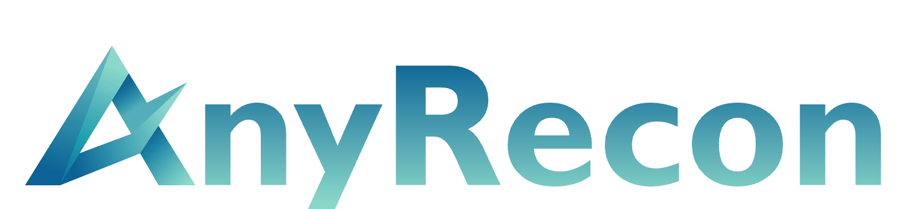

<p align="center" >
    
</p>

<h2 align="center">AnyRecon: Arbitrary-View 3D Reconstruction<br>with Video Diffusion Model</h2>

<div align="center">
  <a href="https://yutian10.github.io">Yutian Chen</a>, 
  <a href="https://guoshi28.github.io">Shi Guo</a>, 
  <a href="https://rbjin.github.io/">Renbiao Jin</a>,
  <a href="https://scholar.google.com/citations?user=9b5dE40AAAAJ&hl=en">Tianshuo Yang</a>,
  <a href="https://caixin98.github.io/">Xin Cai</a>, 
  <a href="https://luo0207.github.io/yawenluo/">Yawen Luo</a>, 
  <a href="">Mingxin Yang</a>, <br>
  <a href="https://mulinyu.github.io/">Mulin Yu</a>, 
  <a href="https://eveneveno.github.io/lnxu/">Linning Xu</a>, 
  <a href="https://tianfan.info/">Tianfan Xue</a>
</div>

<br>

<p align="center"> <a href='https://yutian10.github.io/AnyRecon/'></a> &nbsp;
<a href="https://arxiv.org/abs/2507.05163"></a> &nbsp;
 <a href='https://huggingface.co/yutian05/AnyRecon/tree/main'></a> &nbsp;
 <a href=''></a> &nbsp;
</p>

<p align="center" width="100%">
    
</p>

## TODO List

- [ ] Upload sparse attention weight.

## 🛠️ Environment Setup

###  1. Clone Repository and Setup Environment
```bash
git clone https://github.com/yutian10/AnyRecon.git
cd AnyRecon
conda create -n anyrecon python=3.10 -y
conda activate anyrecon
pip install torch==2.4.1 torchvision==0.19.1 torchaudio==2.4.1 --index-url https://download.pytorch.org/whl/cu118
pip install -r requirements.txt
```

###  2. Download Models
AnyRecon relies on specific pre-trained weights. Please download them and place them in the `./checkpoints` folder.

- Base Video Diffusion Model
- AnyRecon LoRA weights [[download](https://huggingface.co/yutian05/AnyRecon/tree/main)]

## 🚀 Quick Start

### Inference
You can run the inference using the provided `test.sh` script:

```bash
bash test.sh
```

Or you can run the python script directly:
```bash
python run_AnyRecon.py \
    --root_dir example/valley \
    --output_dir example/valley \
    --lora_path full_attention.ckpt
```

## 💗 Acknowledgments
Thanks to these great repositories: [Wan2.1](https://github.com/Wan-Video/Wan2.1) and [DiffSynth-Studio](https://github.com/modelscope/DiffSynth-Studio).

## 🔗 Citation
If you find our work helpful, please cite it:
```
@article{
    
}
```